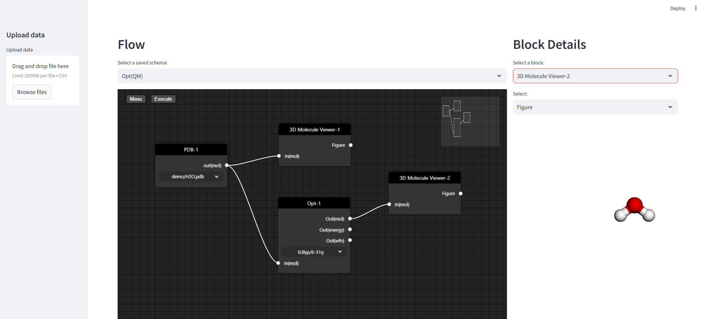
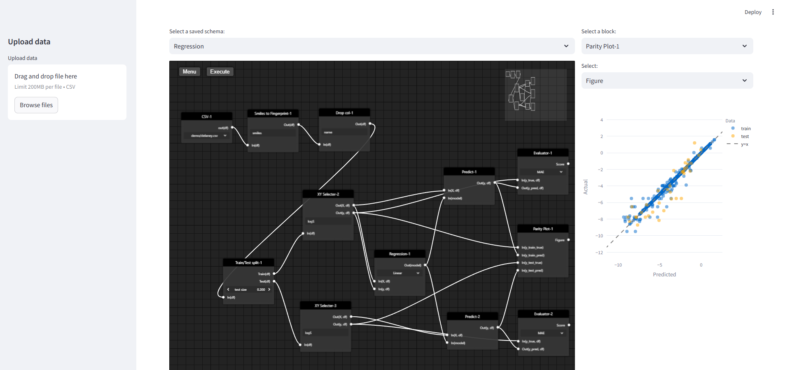

# flowapp

## Overview
flowapp is a flow-based programming tool designed for materials informatics and computational science applications.

### Geometry optimization by Quantum mechanics


### Regression of logS with SMILES


## Features
- Simple and intuitive user interface
- Easy to extend: Add any custom processing by writing Python code
- Built for data pipeline management and monitoring

## Description
flowapp is a tool designed to simplify data flow management and processing. This project aims to make it easy to build, manage, and monitor data pipelines.

## Prerequisites
flowapp requires conda and uses conda-lock for environment management.

Install conda-lock with the following command:

```bash
conda install -c conda-forge conda-lock
```

## Installation

Install flowapp using these commands:

```bash
git clone https://github.com/hodakamori/flowapp.git
cd flowapp
conda-lock install -n flowapp conda-lock.yml
conda activate flowapp
pip install -e .
streamlit run flowapp/app.py
```